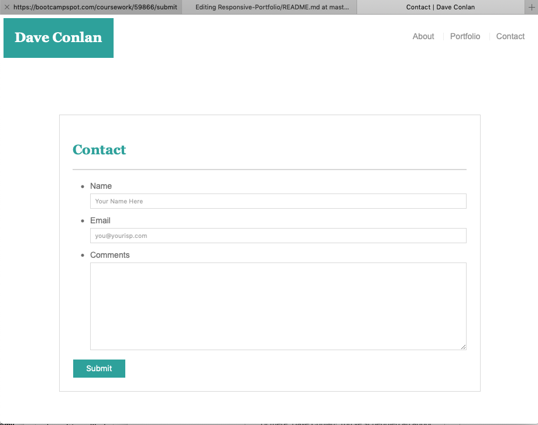
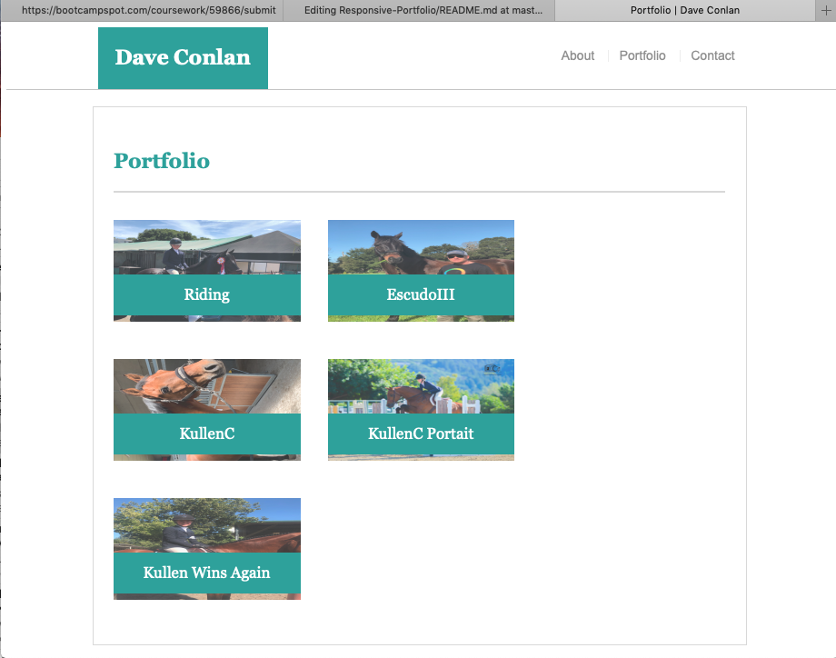
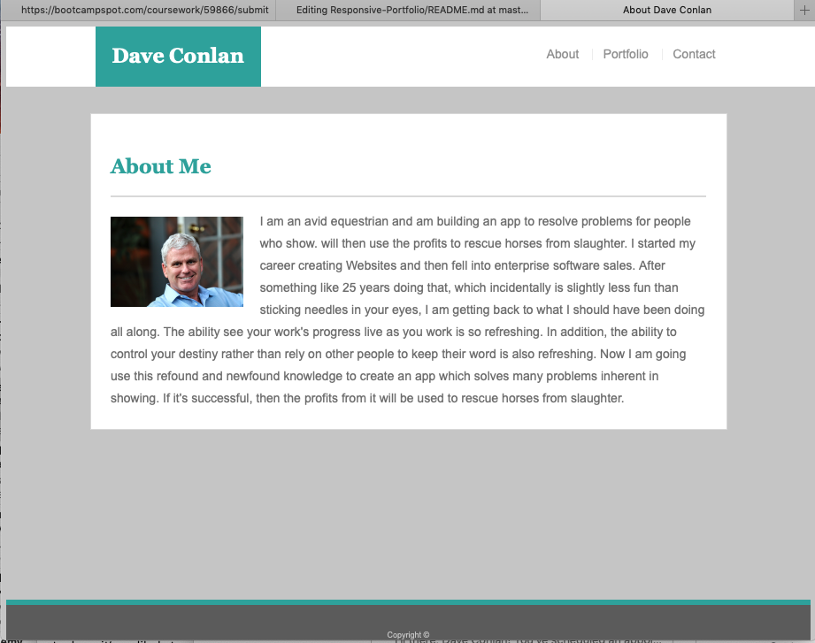

# -Responsive-Portfolio-
UC Berkeley 

This is a class portfolio using responsive layout techniques required for modern mobile applications.  

*One exercise is done using manual resizing techniques within a custom .CSS sheet. 

*The second exercise is done using Bootstrap components tied to their .CSS platform.

*The media query breakpoints were: 576px,768px, 992px, and 1200px. 

Some interseting code is found here: 

*

        

                
                

and here:

 

            

                <nav class="navbar navbar-expand-lg navbar-light bg-light">
                        <button class="navbar-toggler" type="button" data-toggle="collapse" data-target="#navbarNavAltMarkup" aria-controls="navbarNavAltMarkup" aria-expanded="false" aria-label="Toggle navigation">
                          
                        </button>
                    

                        

                          

                            <a class="nav-item nav-link" href="#">Home (current)</a>
                            <a class="nav-item nav-link" href="#">Portfolio</a>
                            <a class="nav-item nav-link" href="#">Contact</a>
                          

                    
                    
                </nav>
            

        

*Here are some walktroughs of the pages

